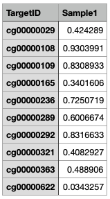
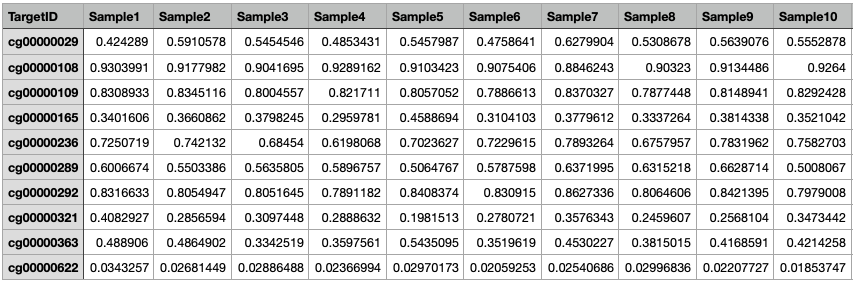

# EnsembleMeAgingClock

## How to prepare your sample files

Single Sample Upload: 
Upload a csv file with your DNA methylation data for a specific sample. The first column should be the cpg labels that correspond to the DNA methylation values in the file. The second column should be your DNA methylation values. Make sure the top of the column with methylation data values is labeled with the sample name (e.g. Sample 1). 
Please refer to [individual01.csv](https://github.com/hayanlee/EnsembleMeAgingClock/blob/main/examples/individual01.csv)as an example. 





Multi-Sample Upload: 
Upload a csv file with the DNA methylation data of multiple samples as multiple sequential columns in the file. The first column should be the cpg labels that correspond to the DNA methylation values in the file. The rest of the columns should be the DNA methylation data per sample. Make sure the top of each column is labeled with the sample name (e.g. Sample 1, Sample 2, etc).
Please refer to [dat0BloodIllumina450K.csv](https://github.com/hayanlee/EnsembleMeAgingClock/blob/main/examples/dat0BloodIllumina450K.csv) as an example. 





Note about Grim Age: 
For the single sample upload for grim age, it asks for an input of age and gender. If the user doesn't have this, simply press submit and the predictions for the other clocks will still be displayed. 


## How to use auxiliary tools (MODIFIED BY JASON LIN)

### extract_cpg_updated.py
This script will extract the overlapping cpgs between your inputed dataset and the dataset of cpgs which the EnsembleMeAgingClock predicts off of. 

Run the following in the terminal replacing <> with the appropriate paths (please ensure that paths have "   .csv")
```python
# Define file paths 
python extract_cpg_updated.py <input path> <output path>
```
After running the script an updated, transposed output file will be obtained that can be put directly into the EnsembleMeAgingClock for analysis. 

```bash
$ head ../examples/dat0BloodIllumina450K.csv 
TargetID,Sample1,Sample2,Sample3,Sample4,Sample5,Sample6,Sample7,Sample8,Sample9,Sample10,Sample11,Sample12,Sample13,Sample14,Sample15
cg00000029,0.424289,0.5910578,0.5454546,0.4853431,0.5457987,0.4758641,0.6279904,0.5308678,0.5639076,0.5552878,0.5179428,0.5532154,0.4495777,0.5639004,0.6036847
cg00000108,0.9303991,0.9177982,0.9041695,0.9289162,0.9103423,0.9075406,0.8846243,0.90323,0.9134486,0.9264,0.8979621,0.9000593,0.9052542,0.9139156,0.9257994
cg00000109,0.8308933,0.8345116,0.8004557,0.821711,0.8057052,0.7886613,0.8370327,0.7877448,0.8148941,0.8292428,0.7726532,0.7967699,NA,0.7722811,0.8479685
cg00000165,0.3401606,0.3660862,0.3798245,0.2959781,0.4588694,0.3104103,0.3779612,0.3337264,0.3814338,0.3521042,0.3675824,0.4191509,0.3028083,0.3801209,0.2968672
cg00000236,0.7250719,0.742132,0.68454,0.6198068,0.7023627,0.7229615,0.7893264,0.6757957,0.7831962,0.7582703,0.719448,0.7242463,0.7597429,0.7582904,0.7892201
cg00000289,0.6006674,0.5503386,0.5635805,0.5896757,0.5064767,0.5787598,0.6371995,0.6315218,0.6628714,0.5008067,0.5723514,0.4899058,0.6188794,0.5432258,0.6739433
cg00000292,0.8316633,0.8054947,0.8051645,0.7891182,0.8408374,0.830915,0.8627336,0.8064606,0.8421395,0.7979008,0.8054491,0.8533473,0.8809193,0.8516175,0.8453441
cg00000321,0.4082927,0.2856594,0.3097448,0.2888632,0.1981513,0.2780721,0.3576343,0.2459607,0.2568104,0.3473442,0.3951134,0.3117475,0.3512069,0.2733728,0.3197865
cg00000363,0.488906,0.4864902,0.3342519,0.3597561,0.5435095,0.3519619,0.4530227,0.3815015,0.4168591,0.4214258,0.4101003,0.4188248,0.4375984,0.4222788,0.4447232
```

```bash
$ python extract_cpg_updated.py ../examples/dat0BloodIllumina450K.csv dat0BloodIllumina450K_cpg_selected.csv
```


--

## How to use auxiliary tools
There are several tools in this directory which are used to combine multiple datasets, create new tables which isolate 'cg' values, and extract 'cg' values from said dataset(s).
Say you have several .csv or .tsv files from different authors. Their CpG values (eg. 'cg00000000') are almost never organized in a standardized way (eg.some CpG values are NOT the leftmost column; some CpG header names are NOT always labeled as 'CpG' or 'var'; rather, they vary based on the discretion of the original researchers). 

### 1. extract_clock_cpgs.py
This script will take a union_file (eg 'union_out.csv'), as well as a tsv_file that the user wishes to use. This tsv_file will be 'extracted' for all elements of itself which are also part of union_out.csv. The extract_clock_cpgs.py script will output a .tsv file which is comprised only of all elements shared between union_out.csv and the original input tsv_file.
In summary, the overall process involves extracting CpG values from various datasets, combining these CpG values into a unique set (the union), and then filtering a large dataset to include only the CpG values in this union. This process allows you to focus on a specific set of CpG values across multiple datasets, which can be useful for many kinds of methylation data analysis.

### 2. union.py
This script will take output(s) from csv_vars_extractor.py (raw CpG value list) and perform a set union on them; that is, it creates a new list that includes all unique CpG values found in any of the input lists. The output of this script is the union_out.csv file, which contains this combined list of unique CpG values.

### 3. csv_vars_extractor.py
This script will take tabular data in order to isolate all CpG values (eg. 'cg00000000'). This script takes in a .tsv and outputs a *headerless* .tsv-- the output is simply a list of unique CpG values. It does not matter whether the data is a large, pickled file-- this script should handle that. This script extracts the CpG values from a tabular data file (like a .tsv or .csv file). The output is a file containing a list of the CpG values found in the data. The output file is indeed headerless, but it's not necessarily a .tsv file—it could be a .csv file or any other format that can store a list of values. The script should be able to handle a variety of input data formats and structures, as long as the data can be read into a pandas DataFrame.


---
